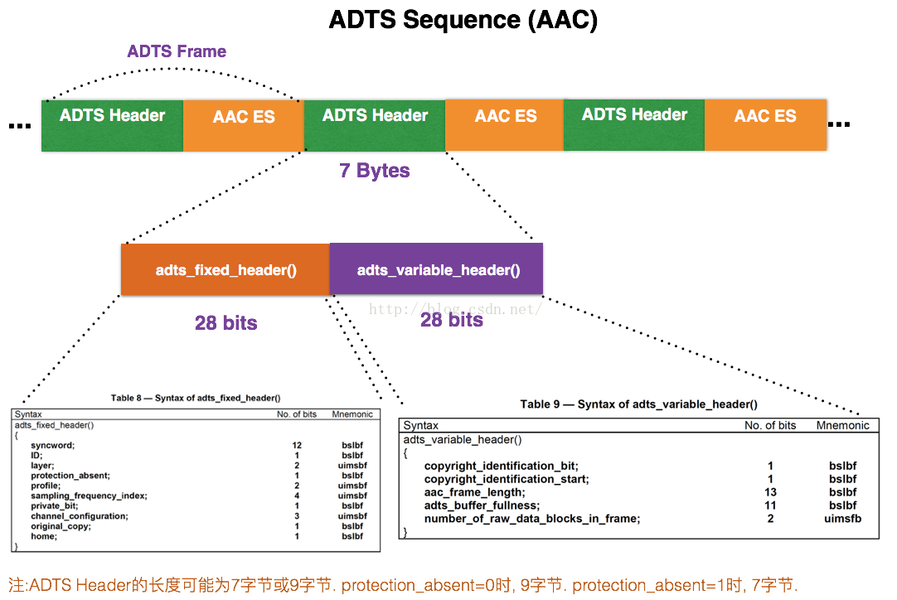
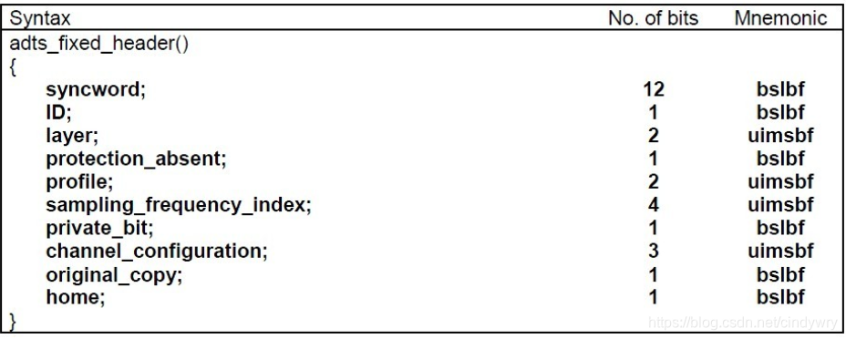
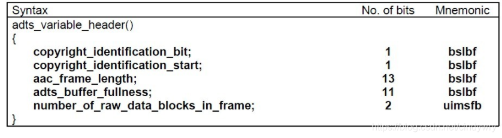

## acc_layout

### ADTS传输

一般情况下 ADTS 的头部信息为 **7个字节**，分为两部分
* adts_fixed_header
* adts_variable_header

#### adts_fixed_header

* syncword  : 同步头，总是 OXFF，代表一个ADTS 帧的开始
* ID ：MPEG 标识符，0 标识 MPEG-4，1 标识 MPEG-2
* Layer : always '00'
* proection_absent : 标识是否误码校验
* profile ： 表示使用哪个级别的AAC
* sampling_frequency_index：表示使用的采样率下标，通过这个下标在 Sampling Frequencies[ ]数组中查找得知采样率的值。

* channel_configuration: 表示声道数，比如2表示立体声双声道

